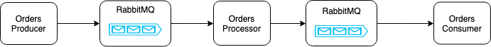

# Building a reactive pipeline with Spring

Phone orders pipeline

##Spring Cloud Stream Support

Spring Cloud Stream supports a variety of binder implementations and the following table includes the link to the GitHub projects.

- RabbitMQ

- Apache Kafka

- Kafka Streams

- Amazon Kinesis

- Google PubSub (partner maintained)

- Solace PubSub+ (partner maintained)

- Azure Event Hubs (partner maintained)

#Docs
- https://docs.spring.io/spring-cloud-stream/docs/current/reference/htmlsingle/
- https://docs.spring.io/spring-cloud-stream/docs/current/reference/htmlsingle/#spring-cloud-stream-overview-reactive-programming-support
- https://projectreactor.io/
- http://www.reactive-streams.org/ - also available in Java 9

- reactive programming
- spring cloud stream (source, sink, processor, channel)

spring.cloud.stream.function.definition=upperCaseIt|reverseIt
